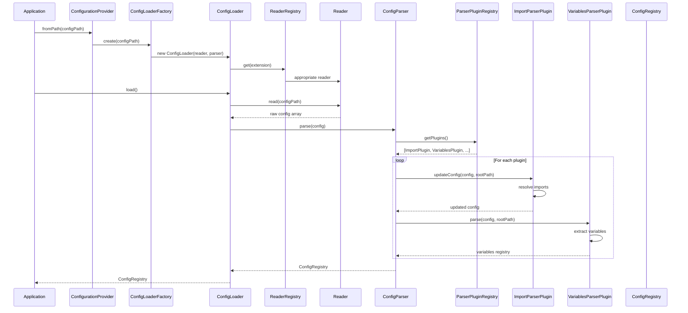
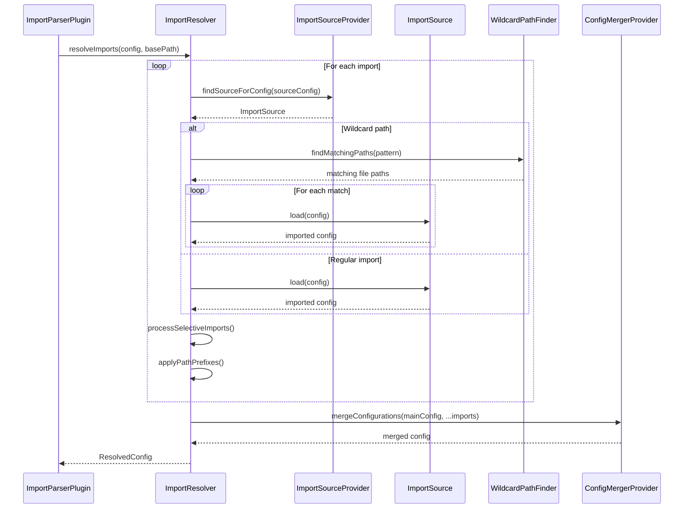
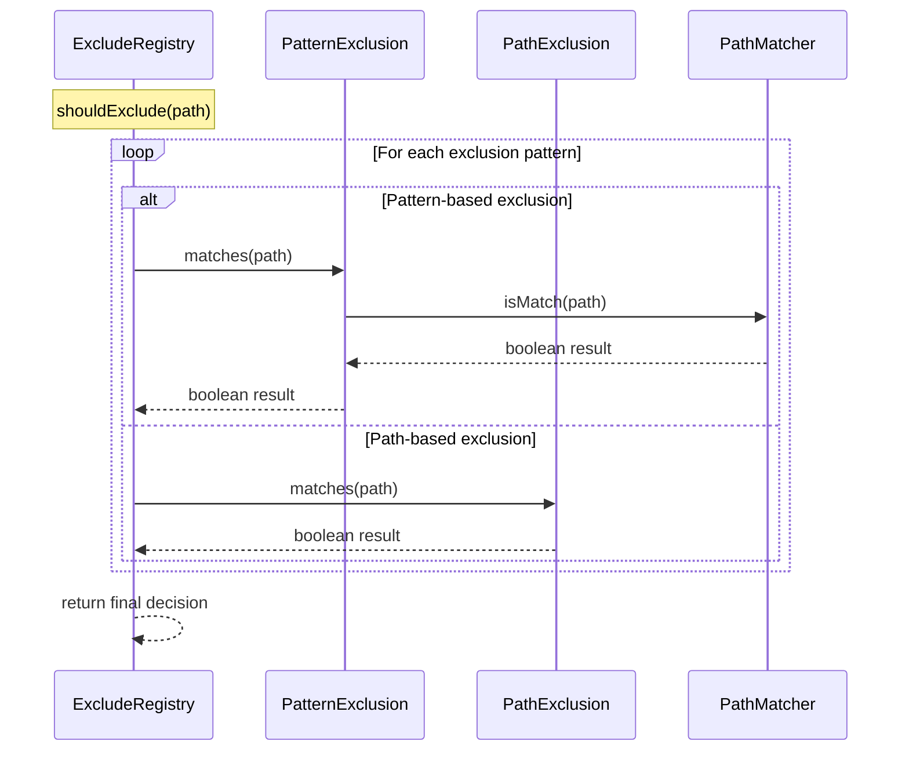

# CTX Configuration System Developer Guide

## Overview

The CTX Configuration System provides a robust, extensible architecture for loading, parsing, and managing configuration files. It supports multiple formats (JSON, YAML, PHP), complex import mechanisms, variable substitution, and plugin-based extensibility.

## Architecture Components

The system follows a layered architecture with clear separation of concerns:

```
Butschster\ContextGenerator\Config\ConfigurationProvider (Entry Point)
├── Butschster\ContextGenerator\Config\Loader\ConfigLoaderFactory (Creates appropriate loaders)
│   ├── Butschster\ContextGenerator\Config\Loader\ConfigLoader (Handles single config files)
│   └── Butschster\ContextGenerator\Config\Loader\CompositeConfigLoader (Combines multiple loaders)
├── Butschster\ContextGenerator\Config\Reader\ConfigReaderRegistry (File format readers)
│   ├── Butschster\ContextGenerator\Config\Reader\JsonReader
│   ├── Butschster\ContextGenerator\Config\Reader\YamlReader
│   ├── Butschster\ContextGenerator\Config\Reader\PhpReader
│   └── Butschster\ContextGenerator\Config\Reader\StringJsonReader
├── Butschster\ContextGenerator\Config\Parser\ConfigParser (Processes configuration data)
│   └── Butschster\ContextGenerator\Config\Parser\ParserPluginRegistry (Extensible parsing plugins)
│       ├── Butschster\ContextGenerator\Config\Import\ImportParserPlugin
│       ├── Butschster\ContextGenerator\Config\Parser\VariablesParserPlugin
│       └── Butschster\ContextGenerator\Config\Exclude\ExcludeParserPlugin
└── Butschster\ContextGenerator\Config\Registry\ConfigRegistry (Final configuration container)
```

## Key Design Principles

### 1. Plugin-Based Extensibility
The system uses plugins to handle different configuration sections, making it easy to add new functionality without modifying core components.

### 2. Format Agnostic
Supports multiple configuration formats through a reader pattern, allowing users to choose their preferred format.

### 3. Import & Composition
Complex configurations can be split across multiple files and composed through imports, supporting both local files and remote URLs.

### 4. Variable Substitution
Dynamic configuration through environment variables and custom variables.

### 5. Error Resilience
Graceful handling of missing files, circular imports, and parsing errors.

## When to Use Different Components

### ConfigurationProvider
**Use when:** You need to load configuration from different sources (inline JSON, file paths, default locations).

```php
use Butschster\ContextGenerator\Config\ConfigurationProvider;

// From specific file
$loader = $provider->fromPath('/path/to/config.yaml');

// From inline JSON
$loader = $provider->fromString('{"documents": [...]}');

// From default location
$loader = $provider->fromDefaultLocation();
```

### ConfigLoader vs CompositeConfigLoader
**ConfigLoader:** Single configuration file
**CompositeConfigLoader:** Try multiple file formats/locations

The factory automatically creates composite loaders when scanning directories.

### Reader Selection
The system automatically selects the appropriate reader based on file extension:
- `.json` → `Butschster\ContextGenerator\Config\Reader\JsonReader`
- `.yaml`, `.yml` → `Butschster\ContextGenerator\Config\Reader\YamlReader`
- `.php` → `Butschster\ContextGenerator\Config\Reader\PhpReader`

### Parser Plugins
**ImportParserPlugin:** Handles `import` sections, resolves file dependencies
**VariablesParserPlugin:** Processes `variables` sections for substitution  
**ExcludeParserPlugin:** Manages file exclusion patterns

## Configuration Loading Flow



## Import System Deep Dive

The import system allows configuration composition across multiple files and sources.

### Local File Imports
```yaml
import:
  - path: "services/api/context.yaml"
    pathPrefix: "/api"
    docs: ["*.md"]  # Selective import
```

### URL Imports
```yaml
import:
  - type: url
    url: "https://example.com/shared-config.yaml"
    ttl: 600
    headers:
      Authorization: "Bearer ${API_TOKEN}"
```

### Wildcard Imports
```yaml
import:
  - path: "services/*/context.yaml"
  - path: "modules/**/*.yaml"
```

### Import Resolution Process



## Variable System

### Variable Resolution Priority
1. **Custom Configuration Variables** (highest priority)
2. **Environment Variables**
3. **Predefined Variables** (lowest priority)

### Built-in Variables
```yaml
variables:
  project_name: "My Project"
  version: "1.0.0"
  
documents:
  - description: "${project_name} Documentation"
    outputPath: "docs/${version}/overview.md"
    sources:
      - type: text
        content: |
          # ${project_name} v${version}
          Generated on: ${DATETIME}
          User: ${USER}
          System: ${OS}
```

### Environment Variable Integration
```bash
# CLI usage
ctx --env=.env.local

# Or in configuration
MCP_FILE_OPERATIONS=true ctx server
```

## Exclusion System

The exclusion system allows filtering out unwanted files and directories.

### Pattern Types
```yaml
exclude:
  patterns:
    - "**/*.tmp"          # Glob patterns
    - "node_modules/**"   # Directory exclusions
    - "*.log"             # File extensions
  paths:
    - "tests"             # Exact path matches
    - "vendor/cache"      # Directory paths
```

### Exclusion Resolution


## Adding Custom Parser Plugins

### 1. Implement ConfigParserPluginInterface

```php
use Butschster\ContextGenerator\Config\Parser\ConfigParserPluginInterface;
use Butschster\ContextGenerator\Config\Registry\RegistryInterface;

final readonly class CustomParserPlugin implements ConfigParserPluginInterface
{
    public function getConfigKey(): string
    {
        return 'custom-section';
    }
    
    public function supports(array $config): bool
    {
        return isset($config['custom-section']);
    }
    
    public function parse(array $config, string $rootPath): ?RegistryInterface
    {
        // Parse your custom section
        $customRegistry = new CustomRegistry();
        // ... parsing logic
        return $customRegistry;
    }
    
    public function updateConfig(array $config, string $rootPath): array
    {
        // Modify config if needed (e.g., for imports)
        return $config;
    }
}
```

### 2. Register the Plugin

```php
use Butschster\ContextGenerator\Config\Parser\ParserPluginRegistry;

// In a bootloader
public function boot(ParserPluginRegistry $registry): void
{
    $registry->register(new CustomParserPlugin());
}
```

## Error Handling Strategies

### 1. Graceful Degradation
The system continues processing other components when one fails:

```php
use Butschster\ContextGenerator\Config\Exception\ConfigLoaderException;
use Butschster\ContextGenerator\Config\Registry\ConfigRegistry;

try {
    $registry = $loader->load();
} catch (ConfigLoaderException $e) {
    $this->logger->error('Config loading failed', ['error' => $e->getMessage()]);
    // Return minimal viable configuration
    return new ConfigRegistry();
}
```

### 2. Circular Import Detection
Prevents infinite loops in import chains:

```php
use Butschster\ContextGenerator\Config\Import\CircularImportDetector;

$detector->beginProcessing($importPath);
try {
    // Process import
} finally {
    $detector->endProcessing($importPath);
}
```

### 3. Validation at Multiple Layers
- **Reader Level:** File format validation
- **Parser Level:** Structure validation
- **Registry Level:** Semantic validation

## Performance Considerations

### 1. Caching Strategies
- **URL Imports:** TTL-based caching to avoid repeated network requests
- **File Watching:** Consider implementing file modification time checks for development

### 2. Lazy Loading
- **Import Resolution:** Only resolve imports when configuration is actually used
- **Plugin Registration:** Defer heavy initialization until needed

### 3. Memory Management
- **Registry Cleanup:** Clear unused registries after processing
- **Stream Processing:** For large configuration files, consider streaming readers

## Testing Configuration Loading

### 1. Unit Testing Individual Components

```php
use Butschster\ContextGenerator\Config\Reader\JsonReader;
use PHPUnit\Framework\TestCase;

public function testJsonReader(): void
{
    $reader = new JsonReader($this->files, $this->logger);
    $config = $reader->read('/path/to/test.json');
    
    $this->assertIsArray($config);
    $this->assertArrayHasKey('documents', $config);
}
```

### 2. Integration Testing Full Flow

```php
use Butschster\ContextGenerator\Config\ConfigurationProvider;
use Butschster\ContextGenerator\Config\Registry\ConfigRegistry;

public function testConfigurationLoading(): void
{
    $provider = $this->getConfigurationProvider();
    $loader = $provider->fromPath('/path/to/config');
    $registry = $loader->load();
    
    $this->assertInstanceOf(ConfigRegistry::class, $registry);
    $this->assertTrue($registry->has('documents'));
}
```

### 3. Testing Import Resolution

```php
use Butschster\ContextGenerator\Config\Import\ImportResolver;

public function testImportResolution(): void
{
    // Create test files with imports
    $this->files->write('/tmp/main.yaml', $this->getMainConfig());
    $this->files->write('/tmp/imported.yaml', $this->getImportedConfig());
    
    $resolver = $this->getImportResolver();
    $result = $resolver->resolveImports($config, '/tmp');
    
    $this->assertArrayHasKey('documents', $result->config);
    $this->assertCount(2, $result->config['documents']); // Main + imported
}
```

## Common Patterns and Best Practices

### 1. Configuration Composition
```yaml
# Main configuration
import:
  - path: "base/common.yaml"
  - path: "environments/${ENV}.yaml"
  - path: "features/*.yaml"

documents:
  - description: "Project-specific documentation"
    # ... project-specific sources
```

### 2. Environment-Specific Overrides
```yaml
# base/common.yaml
variables:
  api_url: "https://api.example.com"

# environments/dev.yaml  
variables:
  api_url: "https://dev-api.example.com"
```

### 3. Modular Plugin Architecture
```php
use Butschster\ContextGenerator\Config\Parser\ConfigParserPluginInterface;

abstract class BaseParserPlugin implements ConfigParserPluginInterface
{
    public function supports(array $config): bool
    {
        return isset($config[$this->getConfigKey()]);
    }
    
    public function updateConfig(array $config, string $rootPath): array
    {
        return $config; // Most plugins don't modify config
    }
}
```

## Debugging Configuration Issues

### 1. Enable Debug Logging
```php
use Monolog\Logger;
use Monolog\Handler\StreamHandler;
use Butschster\ContextGenerator\Config\ConfigurationProvider;

$logger = new Logger('config');
$logger->pushHandler(new StreamHandler('php://stdout', Logger::DEBUG));

$provider = new ConfigurationProvider($factory, $dirs, $logger);
```

### 2. Inspect Registry Contents
```php
use Butschster\ContextGenerator\Config\Registry\ConfigRegistry;

$registry = $loader->load();
foreach ($registry->all() as $type => $typeRegistry) {
    echo "Registry: {$type}\n";
    echo json_encode($typeRegistry, JSON_PRETTY_PRINT) . "\n";
}
```

### 3. Validate Import Resolution
```php
use Butschster\ContextGenerator\Config\Import\ImportResolver;

$resolver = new ImportResolver(/* ... */);
$result = $resolver->resolveImports($config, $basePath);
echo "Resolved imports:\n";
foreach ($result->imports as $import) {
    echo "- {$import->getPath()}\n";
}
```

This configuration system provides a solid foundation for complex, maintainable configuration management while remaining flexible enough to adapt to evolving requirements.