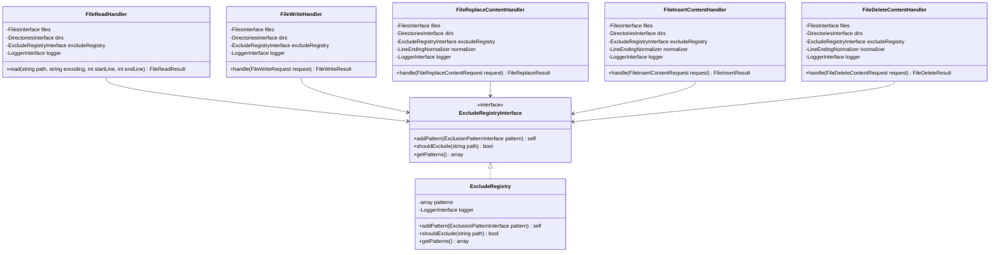
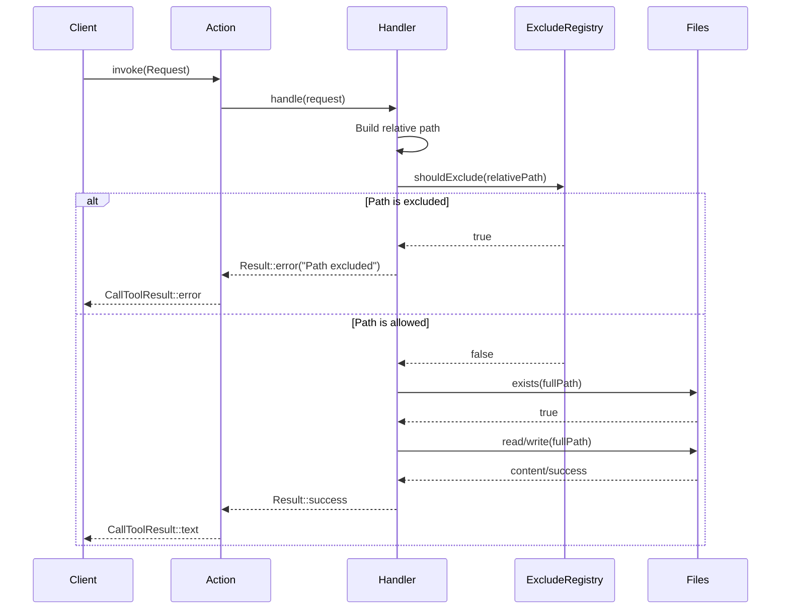

# Technical Architecture

## High-Level Architecture

The exclude system is built around the `ExcludeRegistryInterface` which provides a centralized registry of exclusion
patterns. Each filesystem handler will receive this registry via dependency injection and check paths before performing
operations.

## Integration Points

### Existing Exclude Infrastructure

```
src/Config/Exclude/
├── AbstractExclusion.php          # Base class for exclusions
├── ExcludeBootloader.php          # DI registration
├── ExcludeParserPlugin.php        # YAML config parser
├── ExcludeRegistry.php            # Main registry implementation
├── ExcludeRegistryInterface.php   # Contract for injection
├── ExclusionPatternInterface.php  # Pattern contract
├── PathExclusion.php              # Path-based exclusion
└── PatternExclusion.php           # Glob pattern exclusion
```

### Filesystem Tools Structure (Current)

```
src/McpServer/Action/Tools/Filesystem/
├── DirectoryListAction.php           ✅ Has excludes
├── FileWriteAction.php               ✅ Refactored - delegates to handler
├── Dto/
│   ├── DirectoryListRequest.php
│   ├── FileWriteRequest.php          (kept in original location)
│   └── TreeViewConfig.php
├── FileDeleteContent/
│   ├── Dto/
│   ├── FileDeleteContentAction.php
│   ├── FileDeleteContentHandler.php  ✅ Has excludes
│   └── FileDeleteResult.php
├── FileInsertContent/
│   ├── Dto/
│   ├── FileInsertContentAction.php
│   ├── FileInsertContentHandler.php  ✅ Has excludes
│   └── FileInsertResult.php
├── FileRead/
│   ├── Dto/
│   ├── FileReadAction.php
│   ├── FileReadHandler.php           ✅ Has excludes
│   ├── FileReadResult.php
│   └── MultiFileReadHandler.php
├── FileReplaceContent/
│   ├── Dto/
│   ├── FileReplaceContentAction.php
│   ├── FileReplaceContentHandler.php ✅ Has excludes
│   ├── FileReplaceResult.php
│   ├── LineEnding.php
│   └── LineEndingNormalizer.php
├── FileSearch/
│   ├── Dto/
│   ├── FileSearchAction.php
│   ├── FileSearchHandler.php         ✅ Has excludes
│   ├── FileSearchResult.php
│   └── SearchMatch.php
└── FileWrite/
    ├── FileWriteHandler.php          ✅ NEW - core logic with excludes
    └── FileWriteResult.php           ✅ NEW - result DTO
```

## Class Diagram



## Sequence Diagram: File Operation with Exclude Check



## FileWrite Directory Structure (Implemented)

The FileWrite handler was added while keeping the action and request in their original locations:

```
src/McpServer/Action/Tools/Filesystem/
├── FileWriteAction.php           # Thin action, delegates to handler
├── Dto/
│   └── FileWriteRequest.php      # Kept in original location
└── FileWrite/
    ├── FileWriteHandler.php      # Core logic + excludes
    └── FileWriteResult.php       # Result DTO
```

## Technology Stack

- **PHP 8.3+**: Constructor property promotion, readonly classes
- **Spiral Framework**: Dependency injection, `#[Proxy]` attribute
- **Symfony Finder**: File system operations (used by some tools)
- **PSR-3 Logging**: `LoggerInterface` for debugging

## Dependencies

No new dependencies required. All necessary components exist:

- `ExcludeRegistryInterface` - already defined
- `ExcludeRegistry` - already implemented
- `FilesInterface` - Spiral's file abstraction
- `DirectoriesInterface` - project path resolver
