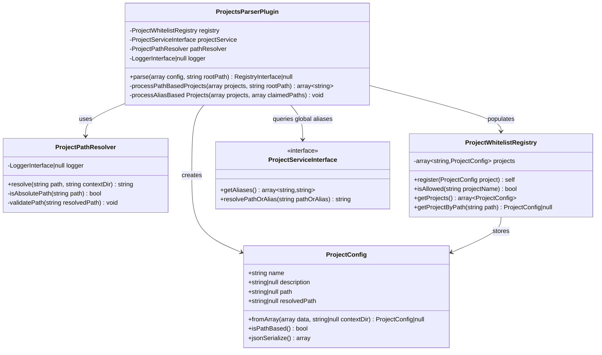
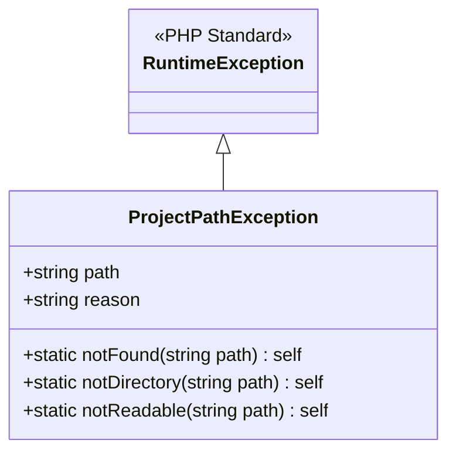
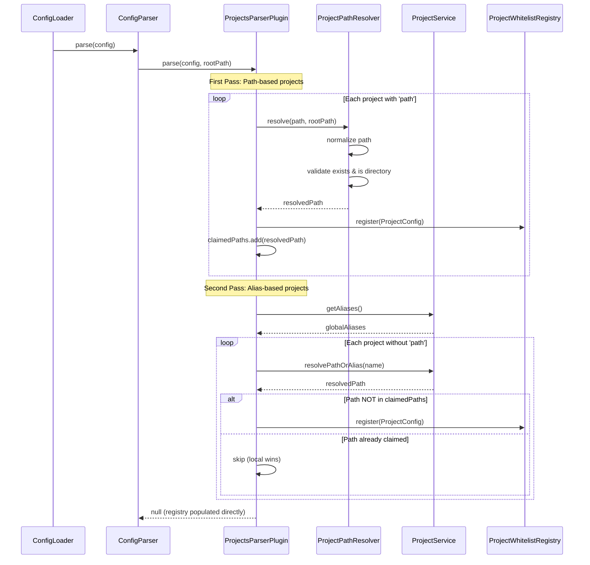
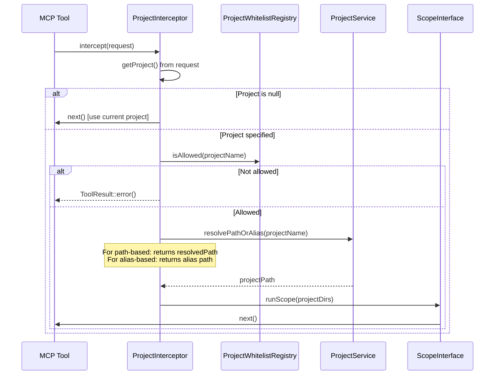

# Feature Request: Project Resolution via Relative/Absolute Paths in YAML Context

**Issue**: #314  
**Status**: ✅ Implemented  
**Author**: butschster  
**Created**: 2026-01-19  
**Completed**: 2026-01-19

---

## Implementation Summary

This feature has been fully implemented across 5 stages:

| Stage | Description | Status |
|-------|-------------|--------|
| Stage 1 | Path Resolution Infrastructure | ✅ Complete |
| Stage 2 | ProjectConfig Enhancement | ✅ Complete |
| Stage 3 | Parser Plugin Two-Pass Resolution | ✅ Complete |
| Stage 4 | Integration Testing | ✅ Complete |
| Stage 5 | Documentation & Cleanup | ✅ Complete |

### Files Created

| File | Purpose |
|------|---------|
| `src/McpServer/Project/Exception/ProjectPathException.php` | Path-specific exception with factory methods |
| `src/McpServer/Project/ProjectPathResolver.php` | Path resolution and validation logic |
| `tests/src/Unit/McpServer/Project/ProjectPathResolverTest.php` | Unit tests for resolver |
| `tests/src/Unit/McpServer/Project/ProjectsParserPluginTest.php` | Unit tests for parser plugin |

### Files Modified

| File | Changes |
|------|---------|
| `src/McpServer/Project/ProjectConfig.php` | Added `path`, `resolvedPath` properties; `isPathBased()`, `withResolvedPath()` methods |
| `src/McpServer/Project/ProjectsParserPlugin.php` | Implemented two-pass resolution algorithm |
| `src/McpServer/Project/ProjectBootloader.php` | Registered `ProjectPathResolver` singleton |
| `tests/src/Unit/McpServer/Project/ProjectConfigTest.php` | Extended with path-related tests |
| `tests/src/McpInspector/Tools/MultiProjectToolTest.php` | Added 8 integration tests for path-based projects |

### Documentation

Updated: `ctx-docs/docs/mcp/projects.md` with comprehensive path-based project documentation including:
- Basic syntax and examples
- Relative vs absolute paths
- Mixed configuration examples
- Priority rules (local overrides global)
- Validation behavior
- MCP tool usage examples

---

## 1. Feature Overview

### Description

Enable inline project definition in YAML context files using `path` field (absolute or relative to the context file location), eliminating the need for global project registration via `ctx project:add`.

### Current Behavior

Projects must be globally registered via `ctx project:add` command and stored in `.project-state.json`. The YAML `projects` section can only reference these pre-registered aliases:

```yaml
projects:
  - name: ctx-mcp-server  # Must exist in .project-state.json
```

### Proposed Behavior

Allow inline project definition with a `path` field:

```yaml
projects:
  # Existing: alias-based (requires global registration)
  - name: ctx-mcp-server
    description: "MCP server library"
  
  # NEW: path-based (no registration needed)
  - name: shared-lib
    path: ../shared/rag-tools          # Relative to context.yaml
    description: "Shared RAG utilities"
  
  - name: vendor-module
    path: ./vendor/ctx/mcp-server      # Relative to context.yaml
  
  - name: external-project
    path: /home/user/work/external     # Absolute path
```

### Business Value

- **Portability**: Clone a repository and everything works — no manual project registration
- **Team Consistency**: All developers get the same project configuration automatically
- **Vendor Support**: Reference packages in `./vendor` without global registration
- **Override Flexibility**: Local definitions can override global aliases with custom names

### Target Audience

- Developers working in team environments
- Projects with vendor/shared dependencies
- CI/CD pipelines that need portable configurations

---

## 2. Technical Architecture

### High-Level Approach

1. **Two-pass resolution algorithm** in `ProjectsParserPlugin`:
   - **First pass**: Process all projects with `path` field, resolve paths, claim them
   - **Second pass**: Process alias-based projects, skip if path already claimed

2. **Local projects have priority over global aliases** — a path-based project overrides any global alias pointing to the same path.

3. **Path resolution** is handled by a new `ProjectPathResolver` class using the existing `FSPath` utility.

### Integration Points

The feature integrates with the existing config parsing system:

```
context.yaml
    ↓
ConfigLoader → ConfigParser → ProjectsParserPlugin (MODIFY)
                                    ↓
                              ProjectPathResolver (NEW)
                                    ↓
                              ProjectWhitelistRegistry
```

### Technology Stack

- **PHP 8.3+**: Constructor property promotion, readonly classes
- **Existing utilities**: `FSPath` for path normalization
- **Spiral Framework**: DI container, bootloaders
- **PSR-3**: Logging interface

---

## 3. Class Diagrams

### Main Entities and Relationships



### Exception Hierarchy



---

## 4. Sequence Diagrams

### Project Resolution Flow



### Tool Execution with Project Context



---

## 5. Public API / Interfaces

### ProjectConfig (Modified)

```php
<?php

declare(strict_types=1);

namespace Butschster\ContextGenerator\McpServer\Project;

final readonly class ProjectConfig implements \JsonSerializable
{
    public function __construct(
        /**
         * Project name/identifier used in MCP tools
         */
        public string $name,
        
        /**
         * Optional description for AI context
         */
        public ?string $description = null,
        
        /**
         * Raw path from YAML (relative or absolute)
         * Null for alias-based projects
         */
        public ?string $path = null,
        
        /**
         * Resolved absolute path (populated by parser)
         * For alias-based: resolved from global aliases
         * For path-based: resolved from path field
         */
        public ?string $resolvedPath = null,
    ) {}

    /**
     * Create from YAML array data
     *
     * @param array{name?: string, description?: string|null, path?: string|null} $data
     * @param string|null $contextDir Directory of context.yaml for relative path resolution
     */
    public static function fromArray(array $data, ?string $contextDir = null): ?self;

    /**
     * Check if this project was defined with a path (vs alias)
     */
    public function isPathBased(): bool;

    public function jsonSerialize(): array;
}
```

### ProjectPathResolver (New)

```php
<?php

declare(strict_types=1);

namespace Butschster\ContextGenerator\McpServer\Project;

use Butschster\ContextGenerator\McpServer\Project\Exception\ProjectPathException;

/**
 * Resolves and validates project paths from YAML configuration
 */
final readonly class ProjectPathResolver
{
    public function __construct(
        private ?LoggerInterface $logger = null,
    ) {}

    /**
     * Resolve a path (relative or absolute) to an absolute path
     *
     * @param string $path Raw path from YAML (relative or absolute)
     * @param string $contextDir Directory containing context.yaml
     * @return string Resolved absolute path
     * @throws ProjectPathException If path is invalid or doesn't exist
     */
    public function resolve(string $path, string $contextDir): string;
}
```

### ProjectPathException (New)

```php
<?php

declare(strict_types=1);

namespace Butschster\ContextGenerator\McpServer\Project\Exception;

final class ProjectPathException extends \RuntimeException
{
    public function __construct(
        public readonly string $path,
        public readonly string $reason,
        string $message,
        ?\Throwable $previous = null,
    ) {
        parent::__construct($message, 0, $previous);
    }

    public static function notFound(string $path): self;
    public static function notDirectory(string $path): self;
    public static function notReadable(string $path): self;
}
```

### Error Handling Approach

| Scenario | Behavior |
|----------|----------|
| Path doesn't exist | Throw `ProjectPathException::notFound()` |
| Path is not a directory | Throw `ProjectPathException::notDirectory()` |
| Path is not readable | Throw `ProjectPathException::notReadable()` |
| Empty path string | Return `null` from `ProjectConfig::fromArray()` |
| Alias not found | Skip silently (existing behavior) |
| Duplicate name (path-based wins) | Log warning, path-based takes priority |

---

## 6. Directory Structure

```
src/McpServer/Project/
├── Exception/
│   ├── ProjectNotAvailableException.php  [existing]
│   └── ProjectPathException.php          [NEW]
├── ProjectAwareRequest.php               [existing]
├── ProjectBootloader.php                 [existing - minor update]
├── ProjectConfig.php                     [MODIFY - add path fields]
├── ProjectInterceptor.php                [existing - no changes]
├── ProjectPathResolver.php               [NEW]
├── ProjectsParserPlugin.php              [MODIFY - two-pass resolution]
├── ProjectWhitelistRegistry.php          [MODIFY - add getProjectByPath]
└── ProjectWhitelistRegistryInterface.php [MODIFY - add getProjectByPath]

tests/src/Unit/McpServer/Project/
├── ProjectConfigTest.php                 [MODIFY - add path tests]
├── ProjectPathResolverTest.php           [NEW]
├── ProjectsParserPluginTest.php          [NEW]
└── ProjectWhitelistRegistryTest.php      [MODIFY - add path lookup tests]
```

### Naming Conventions

- Exception classes: `*Exception.php`
- Test classes: `*Test.php`
- Interfaces: `*Interface.php`

---

## 7. Code References

### Files to Modify

| File | Lines | Description |
|------|-------|-------------|
| `src/McpServer/Project/ProjectConfig.php` | 1-50 | Add `path` and `resolvedPath` fields, update `fromArray()` |
| `src/McpServer/Project/ProjectsParserPlugin.php` | 45-90 | Implement two-pass resolution algorithm |
| `src/McpServer/Project/ProjectWhitelistRegistry.php` | 20-60 | Add `getProjectByPath()` method |
| `src/McpServer/Project/ProjectWhitelistRegistryInterface.php` | 15-30 | Add `getProjectByPath()` signature |
| `src/McpServer/Project/ProjectBootloader.php` | 30-50 | Register `ProjectPathResolver` |

### Files to Create

| File | Purpose |
|------|---------|
| `src/McpServer/Project/ProjectPathResolver.php` | Path resolution and validation logic |
| `src/McpServer/Project/Exception/ProjectPathException.php` | Path-specific exceptions |
| `tests/src/Unit/McpServer/Project/ProjectPathResolverTest.php` | Unit tests for resolver |
| `tests/src/Unit/McpServer/Project/ProjectsParserPluginTest.php` | Unit tests for parser |

### Integration Points

```
src/Config/Parser/ConfigParser.php:25-35
  - Calls plugin.parse() with rootPath parameter
  - rootPath is used as contextDir for path resolution

src/McpServer/Project/ProjectInterceptor.php:83-84
  - Uses projectService.resolvePathOrAlias() 
  - Works unchanged for both path-based and alias-based projects

vendor/ctx/mcp-server/src/Projects/ProjectService.php:150-155
  - resolvePathOrAlias() already handles direct paths
  - No changes needed in vendor package
```

---

## 8. Implementation Considerations

### Potential Challenges

1. **Cross-platform path handling**
   - Windows vs Unix path separators
   - Solution: Use existing `FSPath` utility which handles this

2. **Relative path base directory**
   - Must be context file directory, not CWD
   - Solution: Pass `rootPath` from `ConfigParser` to resolver

3. **Path normalization for comparison**
   - Same physical path may have different string representations
   - Solution: Normalize all paths through `FSPath` before storing/comparing

### Edge Cases

| Case | Expected Behavior |
|------|-------------------|
| `path: ./same-dir` | Resolves relative to context.yaml directory |
| `path: ../sibling` | Navigates up and resolves |
| `path: /absolute/path` | Uses as-is (validates existence) |
| `path: ~/home-relative` | **Not supported** - treat as relative path |
| Same path, different names | First definition wins |
| Symlinked paths | Resolve to real path for comparison |

### Performance Considerations

- Path resolution happens once during config parsing
- No runtime overhead for tool execution
- `file_exists()` and `is_dir()` calls are cached by PHP

### Security Concerns

- **Path traversal**: Paths are validated to exist and be directories
- **Symlink attacks**: Consider using `realpath()` for canonical paths
- **Permission checks**: Verify directory is readable

---

## 9. Testing Strategy

### Unit Tests

#### ProjectConfigTest (Extend)

```php
#[Test]
public function it_creates_with_path(): void;

#[Test]
public function it_creates_from_array_with_path(): void;

#[Test]
public function it_identifies_path_based_project(): void;

#[Test]
public function it_identifies_alias_based_project(): void;

#[Test]
public function it_serializes_path_to_json(): void;
```

#### ProjectPathResolverTest (New)

```php
#[Test]
public function it_resolves_relative_path(): void;

#[Test]
public function it_resolves_absolute_path(): void;

#[Test]
public function it_throws_for_non_existent_path(): void;

#[Test]
public function it_throws_for_file_instead_of_directory(): void;

#[Test]
public function it_normalizes_path_separators(): void;

#[Test]
public function it_handles_dot_segments(): void;
```

#### ProjectsParserPluginTest (New)

```php
#[Test]
public function it_registers_path_based_project(): void;

#[Test]
public function it_registers_alias_based_project(): void;

#[Test]
public function it_prioritizes_path_over_alias_same_path(): void;

#[Test]
public function it_skips_invalid_paths(): void;

#[Test]
public function it_handles_mixed_projects(): void;
```

### Integration Tests

#### MultiProjectToolTest (Extend)

```php
#[Test]
public function file_read_works_with_path_based_project(): void;

#[Test]
public function path_based_project_overrides_global_alias(): void;
```

### Edge Cases to Cover

- Empty path string
- Path with trailing slash
- Path with `..` segments escaping project root
- Circular symlinks
- Non-UTF8 path characters
- Very long paths (near OS limits)

---

## 10. Acceptance Criteria

### Functional Requirements

- [ ] Projects can be defined with `path` field in YAML
- [ ] Relative paths resolve correctly from context.yaml directory
- [ ] Absolute paths work as expected
- [ ] Path-based projects take priority over global aliases with same resolved path
- [ ] Existing alias-based projects continue to work unchanged
- [ ] Invalid paths produce clear error messages
- [ ] Tools work correctly with path-based projects

### Non-Functional Requirements

- [ ] No performance regression in config loading
- [ ] Cross-platform compatibility (Linux, macOS, Windows)
- [ ] Backward compatible with existing configurations
- [ ] Comprehensive test coverage (>90%)

### Definition of Done

1. All new code has unit tests
2. Integration tests pass with MCP inspector
3. Documentation updated (if applicable)
4. No breaking changes to existing API
5. Code reviewed and approved
6. Manual testing on Linux and macOS

---

## Appendix: Example Configurations

### Basic Usage

```yaml
projects:
  - name: local-lib
    path: ./libs/shared
    description: "Shared library in same repo"
```

### Override Global Alias

```yaml
# Global: ctx-mcp-server → /home/user/.ctx/mcp-server

projects:
  # Uses local vendor version instead
  - name: ctx-mcp-server
    path: ./vendor/ctx/mcp-server
```

### Mixed Configuration

```yaml
projects:
  # Path-based (local)
  - name: my-shared
    path: ../shared-modules
    
  # Alias-based (global registration)
  - name: company-tools
    description: "Company-wide tools"
```
