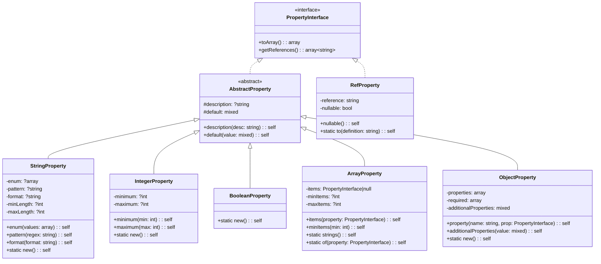

# Feature Request: Modular JSON Schema Builder

## Issue #50

**Status:** Draft  
**Priority:** Medium  
**Type:** Enhancement  
**Estimated Effort:** 3-5 days

---

## 1. Feature Overview

### Description

Build a modular PHP-based JSON Schema generator where each module (sources, modifiers, prompts, tools, etc.) can
register its own schema definitions via bootloaders. A console command compiles all registered definitions into a single
`json-schema.json` file.

### Business Value

- **Maintainability**: Schema stays in sync with code - each module owns its schema
- **Extensibility**: Third-party modules can register their own schemas
- **Type Safety**: PHP classes ensure valid schema structure with IDE autocomplete
- **Validation**: Build-time reference validation catches errors before commit
- **DX**: Developers modify schema alongside code, not in a separate 1500+ line JSON file

### Target Users

- CTX maintainers adding new sources/modifiers
- Third-party developers creating CTX plugins
- CI/CD pipelines validating schema integrity

---

## 2. Technical Architecture

### High-Level Approach

```
┌─────────────────────────────────────────────────────────────────┐
│                         Kernel                                   │
│  ┌──────────────┐ ┌──────────────┐ ┌──────────────┐             │
│  │FileSource    │ │GitDiffSource │ │Sanitizer     │ ...         │
│  │Bootloader    │ │Bootloader    │ │Bootloader    │             │
│  └──────┬───────┘ └──────┬───────┘ └──────┬───────┘             │
│         │                │                │                      │
│         ▼                ▼                ▼                      │
│  ┌─────────────────────────────────────────────────────────┐    │
│  │              SchemaDefinitionRegistry                    │    │
│  │  - definitions: array<string, DefinitionInterface>       │    │
│  │  - rootProperties: array<string, PropertyInterface>      │    │
│  │  - build(): array (compiles to JSON Schema)              │    │
│  └─────────────────────────────────────────────────────────┘    │
└─────────────────────────────────────────────────────────────────┘
                              │
                              ▼
                    ┌──────────────────┐
                    │ schema:build     │
                    │ Console Command  │
                    └────────┬─────────┘
                             │
                             ▼
                    ┌──────────────────┐
                    │ json-schema.json │
                    └──────────────────┘
```

### Integration with Existing Codebase

- **Registry Pattern**: Follows `SourceRegistryInterface` / `SourceModifierRegistry` patterns
- **Bootloader Registration**: Each module's existing bootloader registers its schema
- **Console Commands**: New `schema:build` command alongside existing `schema` command

### Technology Stack

- PHP 8.3+ with strict types
- Spiral Framework bootloaders
- No external dependencies (pure PHP)
- Optional: `spiral/json-schema-generator` for simple DTO conversion

---

## 3. Class Diagrams

### Core Components


### Property Types



### Combinators


---

## 4. Sequence Diagrams

### Schema Registration Flow


### Schema Build Flow


### Module Registration Lifecycle


---

## 5. Public API / Interfaces

### SchemaDefinitionRegistry

```php
<?php

namespace Butschster\ContextGenerator\JsonSchema;

interface SchemaDefinitionRegistryInterface
{
    /**
     * Define a new object definition.
     * Returns the definition for fluent configuration.
     */
    public function define(string $name): Definition\ObjectDefinition;
    
    /**
     * Get an existing definition by name.
     */
    public function get(string $name): ?Definition\DefinitionInterface;
    
    /**
     * Check if a definition exists.
     */
    public function has(string $name): bool;
    
    /**
     * Add a property to the root schema.
     */
    public function addRootProperty(string $name, Property\PropertyInterface $property): self;
    
    /**
     * Mark root properties as required.
     */
    public function addRootRequired(string ...$names): self;
    
    /**
     * Set schema metadata ($schema, id, title, etc.).
     */
    public function setMetadata(SchemaMetadata $metadata): self;
    
    /**
     * Build the complete JSON Schema array.
     * @throws SchemaValidationException if references are invalid
     */
    public function build(): array;
}
```

### PropertyInterface

```php
<?php

namespace Butschster\ContextGenerator\JsonSchema\Property;

interface PropertyInterface
{
    /**
     * Convert to JSON Schema array representation.
     */
    public function toArray(): array;
    
    /**
     * Get all $ref references used by this property.
     * @return array<string> Definition names referenced
     */
    public function getReferences(): array;
}
```

### DefinitionInterface

```php
<?php

namespace Butschster\ContextGenerator\JsonSchema\Definition;

interface DefinitionInterface
{
    /**
     * Get the definition name (used in #/definitions/{name}).
     */
    public function getName(): string;
    
    /**
     * Convert to JSON Schema array representation.
     */
    public function toArray(): array;
    
    /**
     * Get all $ref references used by this definition.
     * @return array<string> Definition names referenced
     */
    public function getReferences(): array;
}
```

### ObjectDefinition (Fluent Builder)

```php
<?php

namespace Butschster\ContextGenerator\JsonSchema\Definition;

final class ObjectDefinition implements DefinitionInterface
{
    public static function create(string $name): self;
    
    public function property(string $name, Property\PropertyInterface $property): self;
    public function required(string ...$names): self;
    public function title(string $title): self;
    public function description(string $description): self;
    public function additionalProperties(bool|Property\PropertyInterface $value): self;
    
    public function getName(): string;
    public function toArray(): array;
    public function getReferences(): array;
}
```

### Property Builders

```php
<?php

namespace Butschster\ContextGenerator\JsonSchema\Property;

// String property
StringProperty::new()
    ->description('Human-readable description')
    ->enum(['value1', 'value2'])
    ->pattern('^[a-z]+$')
    ->format('uri')
    ->default('value1');

// Integer property
IntegerProperty::new()
    ->minimum(0)
    ->maximum(100)
    ->default(10);

// Boolean property
BooleanProperty::new()
    ->description('Enable feature')
    ->default(true);

// Array property
ArrayProperty::strings()  // array of strings
ArrayProperty::of(RefProperty::to('source'))  // array of $ref
ArrayProperty::of(StringProperty::new()->enum(['a', 'b']))

// Object property (inline)
ObjectProperty::new()
    ->property('key', StringProperty::new())
    ->additionalProperties(StringProperty::new());

// Reference property
RefProperty::to('fileSource')  // {"$ref": "#/definitions/fileSource"}
RefProperty::to('modifiers')->nullable()  // with null option
```

### Combinators

```php
<?php

namespace Butschster\ContextGenerator\JsonSchema\Combinator;

// oneOf
OneOf::create(
    StringProperty::new(),
    RefProperty::to('treeViewConfig'),
);

// anyOf  
AnyOf::create(
    RefProperty::to('fileSource'),
    RefProperty::to('urlSource'),
);

// allOf
AllOf::create(
    RefProperty::to('baseSource'),
    ObjectProperty::new()->property('extra', StringProperty::new()),
);

// Conditional (if/then/else)
Conditional::when('type', 'file')
    ->then(RefProperty::to('fileSource'))
    ->else(RefProperty::to('urlSource'));
```

### Error Handling

```php
<?php

namespace Butschster\ContextGenerator\JsonSchema\Exception;

class SchemaException extends \RuntimeException {}

class SchemaValidationException extends SchemaException
{
    /** @var array<string> */
    public readonly array $missingReferences;
    
    /** @var array<string> */
    public readonly array $circularReferences;
}

class DuplicateDefinitionException extends SchemaException
{
    public readonly string $definitionName;
}
```

---

## 6. Directory Structure

```
src/JsonSchema/
├── SchemaBuilderBootloader.php          # Core bootloader, registers singleton
├── SchemaDefinitionRegistry.php         # Main registry implementation
├── SchemaDefinitionRegistryInterface.php
├── SchemaMetadata.php                   # $schema, id, title, fileMatch
│
├── Definition/
│   ├── DefinitionInterface.php
│   ├── ObjectDefinition.php             # Object schema with properties
│   └── EnumDefinition.php               # String/int enum schema
│
├── Property/
│   ├── PropertyInterface.php
│   ├── AbstractProperty.php             # Base with description, default
│   ├── StringProperty.php
│   ├── IntegerProperty.php
│   ├── BooleanProperty.php
│   ├── ArrayProperty.php
│   ├── ObjectProperty.php
│   └── RefProperty.php                  # $ref wrapper
│
├── Combinator/
│   ├── CombinatorInterface.php
│   ├── OneOf.php
│   ├── AnyOf.php
│   ├── AllOf.php
│   └── Conditional.php                  # if/then/else
│
├── Exception/
│   ├── SchemaException.php
│   ├── SchemaValidationException.php
│   └── DuplicateDefinitionException.php
│
└── Console/
    └── BuildSchemaCommand.php           # ctx schema:build
```

---

## 7. Code References

### Bootloader Pattern

- `src/Source/File/FileSourceBootloader.php:29-35` - Example of init() registration pattern
- `src/Source/Registry/SourceRegistryBootloader.php:12-18` - Singleton registry pattern
- `src/Modifier/ModifierBootloader.php:14-17` - Simple registry singleton

### Console Command Pattern

- `src/Console/SchemaCommand.php:1-95` - Existing schema command (to be extended)
- `src/Console/BaseCommand.php:22-61` - Base command with logger setup
- `src/Console/GenerateCommand.php:74-100` - Scope binding pattern

### Registry Pattern

- `src/Source/Registry/SourceRegistryInterface.php:8-14` - Simple registry interface
- `src/Modifier/SourceModifierRegistry.php` - Modifier registry implementation

### Kernel Registration

- `src/Application/Kernel.php:65-97` - Where bootloaders are registered

### Existing JSON Schema

- `json-schema.json:1-1500+` - Current schema to be generated

---

## 8. Implementation Considerations

### Potential Challenges

1. **Reference Validation**: Must validate all `$ref` pointers exist before build
2. **Circular References**: Detect and handle circular definition references
3. **Order Independence**: Definitions can reference not-yet-registered definitions
4. **Conditional Schemas**: Complex `if/then/else` and `allOf` combinations

### Edge Cases

1. **Empty definitions**: Definition with no properties
2. **Self-referencing**: Definition that references itself (valid in JSON Schema)
3. **Nullable refs**: `oneOf: [{"$ref": "..."}, {"type": "null"}]`
4. **Pattern properties**: `additionalProperties` with specific patterns
5. **Multiple types**: `type: ["string", "number"]`

### Performance Considerations

- Schema build happens once per `schema:build` command (not runtime)
- Registry is singleton - no repeated allocations
- Lazy definition resolution at build time

### Security Concerns

- No user input involved - all definitions from code
- Output file is static JSON - no injection vectors
- File write uses existing `FilesInterface` with proper permissions

---

## 9. Testing Strategy

### Unit Tests

```php
// Property tests
test('StringProperty generates correct schema', function () {
    $property = StringProperty::new()
        ->enum(['a', 'b'])
        ->default('a');
    
    expect($property->toArray())->toBe([
        'type' => 'string',
        'enum' => ['a', 'b'],
        'default' => 'a',
    ]);
});

// Definition tests
test('ObjectDefinition tracks required properties', function () {
    $def = ObjectDefinition::create('test')
        ->required('name', 'type')
        ->property('name', StringProperty::new())
        ->property('type', StringProperty::new());
    
    expect($def->toArray()['required'])->toBe(['name', 'type']);
});

// Reference validation tests
test('Registry throws on missing reference', function () {
    $registry = new SchemaDefinitionRegistry();
    $registry->define('source')
        ->property('config', RefProperty::to('nonexistent'));
    
    expect(fn() => $registry->build())
        ->toThrow(SchemaValidationException::class);
});
```

### Integration Tests

```php
test('Full schema builds without errors', function () {
    $container = $this->getContainer();
    $registry = $container->get(SchemaDefinitionRegistry::class);
    
    // All bootloaders have registered their schemas
    $schema = $registry->build();
    
    expect($schema)->toHaveKey('$schema')
        ->and($schema)->toHaveKey('definitions')
        ->and($schema['definitions'])->toHaveKey('fileSource')
        ->and($schema['definitions'])->toHaveKey('gitDiffSource');
});

test('Generated schema matches expected structure', function () {
    $registry = new SchemaDefinitionRegistry();
    // ... register all definitions
    
    $schema = $registry->build();
    $expected = json_decode(file_get_contents('json-schema.json'), true);
    
    expect($schema)->toEqual($expected);
});
```

### Edge Case Tests

```php
test('Handles self-referencing definitions', function () {
    $registry = new SchemaDefinitionRegistry();
    $registry->define('node')
        ->property('children', ArrayProperty::of(RefProperty::to('node')));
    
    $schema = $registry->build();
    
    expect($schema['definitions']['node']['properties']['children']['items'])
        ->toBe(['$ref' => '#/definitions/node']);
});

test('Handles nullable references', function () {
    $property = RefProperty::to('config')->nullable();
    
    expect($property->toArray())->toBe([
        'oneOf' => [
            ['$ref' => '#/definitions/config'],
            ['type' => 'null'],
        ],
    ]);
});
```

---

## 10. Acceptance Criteria

### Definition of Done

- [ ] `SchemaDefinitionRegistry` singleton registered in container
- [ ] All existing sources register their schema definitions
- [ ] All existing modifiers register their schema definitions
- [ ] Core definitions (document, source, modifiers, etc.) registered
- [ ] `schema:build` command generates valid JSON Schema
- [ ] Generated schema validates against Draft-07 spec
- [ ] Generated schema matches current `json-schema.json` structure
- [ ] Unit tests for all property types and combinators
- [ ] Integration test comparing generated vs existing schema
- [ ] Documentation updated with module schema registration guide

### Measurable Success Criteria

1. **Parity**: Generated `json-schema.json` validates same configs as current
2. **Coverage**: 100% of existing definitions generated from code
3. **Validation**: `build()` catches all invalid references
4. **Performance**: Build completes in < 100ms
5. **Extensibility**: New source can register schema in < 10 lines of code

### Verification Steps

```bash
# Build schema
php ctx schema:build

# Validate generated schema against meta-schema
ajv validate -s draft-07.json -d json-schema.json

# Validate existing configs against generated schema
ajv validate -s json-schema.json -d context.yaml

# Run test suite
./vendor/bin/pest --filter=JsonSchema
```

---

## Implementation Stages

### Stage 1: Core Infrastructure

- [ ] Create directory structure
- [ ] Implement `PropertyInterface` and all property types
- [ ] Implement `DefinitionInterface` and `ObjectDefinition`
- [ ] Implement `SchemaDefinitionRegistry`
- [ ] Unit tests for core components

### Stage 2: Combinators

- [ ] Implement `OneOf`, `AnyOf`, `AllOf`
- [ ] Implement `Conditional` (if/then/else)
- [ ] Unit tests for combinators

### Stage 3: Bootloader Integration

- [ ] Create `SchemaBuilderBootloader`
- [ ] Register core definitions (sourcePaths, filePattern, etc.)
- [ ] Create `BuildSchemaCommand`

### Stage 4: Module Migration

- [ ] Migrate source definitions (file, url, github, gitlab, git_diff, etc.)
- [ ] Migrate modifier definitions (php-content-filter, php-docs, sanitizer)
- [ ] Migrate tool definitions
- [ ] Migrate prompt definitions

### Stage 5: Validation & Polish

- [ ] Reference validation in `build()`
- [ ] Integration tests
- [ ] Compare generated schema with existing
- [ ] Documentation

---

## Notes

- Consider using `spiral/json-schema-generator` for simple DTOs that map 1:1 to schema objects
- The existing `SchemaCommand` downloads schema from GitHub; the new `schema:build` generates it locally
- Schema metadata ($schema, id, fileMatch) should be configurable but have sensible defaults
